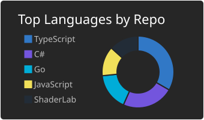

## My Portfolio Site is [here](https://artemit.dev/)!

<!--
**Artemol/Artemol** is a ✨ _special_ ✨ repository because its `README.md` (this file) appears on your GitHub profile.

Here are some ideas to get you started:

- 🔭 I’m currently working on ...
- 🌱 I’m currently learning ...
- 👯 I’m looking to collaborate on ...
- 🤔 I’m looking for help with ...
- 💬 Ask me about ...
- 📫 How to reach me: ...
- 😄 Pronouns: ...
- ⚡ Fun fact: ...
-->

## ⚡GitHub Stats
[](https://github.com/vn7n24fzkq/github-profile-summary-cards)
[](https://github.com/vn7n24fzkq/github-profile-summary-cards) [](https://github.com/vn7n24fzkq/github-profile-summary-cards)
[](https://github.com/vn7n24fzkq/github-profile-summary-cards) [](https://github.com/vn7n24fzkq/github-profile-summary-cards)

<!--
## 🌱 My Skills (Including Learnings)

### Languages
[](https://skillicons.dev)

### Editors
[](https://skillicons.dev)

### Frameworks
[](https://skillicons.dev)

### Tools
[](https://skillicons.dev)

### OS
[](https://skillicons.dev)

### Others
[](https://skillicons.dev)
-->

## 💬WakaTime Stats
<!--START_SECTION:waka-->


**I'm a Night 🦉** 

```text
🌞 Morning                624 commits         ██░░░░░░░░░░░░░░░░░░░░░░░   09.48 % 
🌆 Daytime                2297 commits        █████████░░░░░░░░░░░░░░░░   34.90 % 
🌃 Evening                1252 commits        █████░░░░░░░░░░░░░░░░░░░░   19.02 % 
🌙 Night                  2409 commits        █████████░░░░░░░░░░░░░░░░   36.60 % 
```
📅 **I'm Most Productive on Tuesday** 

```text
Monday                   1039 commits        ████░░░░░░░░░░░░░░░░░░░░░   15.79 % 
Tuesday                  1240 commits        █████░░░░░░░░░░░░░░░░░░░░   18.84 % 
Wednesday                798 commits         ███░░░░░░░░░░░░░░░░░░░░░░   12.12 % 
Thursday                 824 commits         ███░░░░░░░░░░░░░░░░░░░░░░   12.52 % 
Friday                   860 commits         ███░░░░░░░░░░░░░░░░░░░░░░   13.07 % 
Saturday                 720 commits         ███░░░░░░░░░░░░░░░░░░░░░░   10.94 % 
Sunday                   1101 commits        ████░░░░░░░░░░░░░░░░░░░░░   16.73 % 
```


📊 **This Week I Spent My Time On** 

```text
🕑︎ Time Zone: Asia/Tokyo

💬 Programming Languages: 
Python                   2 hrs 55 mins       █████████████████░░░░░░░░   67.10 % 
Markdown                 49 mins             █████░░░░░░░░░░░░░░░░░░░░   18.91 % 
Git Config               19 mins             ██░░░░░░░░░░░░░░░░░░░░░░░   07.41 % 
YAML                     15 mins             █░░░░░░░░░░░░░░░░░░░░░░░░   05.95 % 
Other                    1 min               ░░░░░░░░░░░░░░░░░░░░░░░░░   00.63 % 

🔥 Editors: 
Claude Code              4 hrs 21 mins       █████████████████████████   100.00 % 

💻 Operating System: 
Mac                      3 hrs 4 mins        ██████████████████░░░░░░░   70.57 % 
Linux                    1 hr 17 mins        ███████░░░░░░░░░░░░░░░░░░   29.43 % 
```

🤖 **AI Coding This Week** 

```text
⏱ AI Coding Time: 4 hrs 21 mins (100.0%)

✍️ 2,314 lines written by AI, 0 lines written by hand (100.0% AI-written)

🔤 2,365,716 Input Tokens, 470,936 Output Tokens

💵 $33.09 Estimated AI Cost This Week

🧠 6 AI Sessions, 69 AI Prompts

Opus                     2,345 lines         █████████████████████████   100.00 % 
Haiku                    0 lines             ░░░░░░░░░░░░░░░░░░░░░░░░░   00.00 % 

🔎 AI Coding Insights:
🤖 AI-Driven — 100.0% of written lines came from AI
📚 Verbose Prompter — average 2,857 characters per prompt
🔁 Iterative Prompter — average 12 prompts per session
🚀 High AI Trust — 0.0% of changed lines were hand-edited
```

**I Mostly Code in TypeScript** 

```text
Go                       6 repos             ██░░░░░░░░░░░░░░░░░░░░░░░   08.82 % 
Shell                    2 repos             █░░░░░░░░░░░░░░░░░░░░░░░░   02.94 % 
HTML                     2 repos             █░░░░░░░░░░░░░░░░░░░░░░░░   02.94 % 
Rust                     2 repos             █░░░░░░░░░░░░░░░░░░░░░░░░   02.94 % 
C++                      1 repo              ░░░░░░░░░░░░░░░░░░░░░░░░░   01.47 % 
```


 Last Updated on 27/11/2026 18:38:20 UTC
<!--END_SECTION:waka-->
